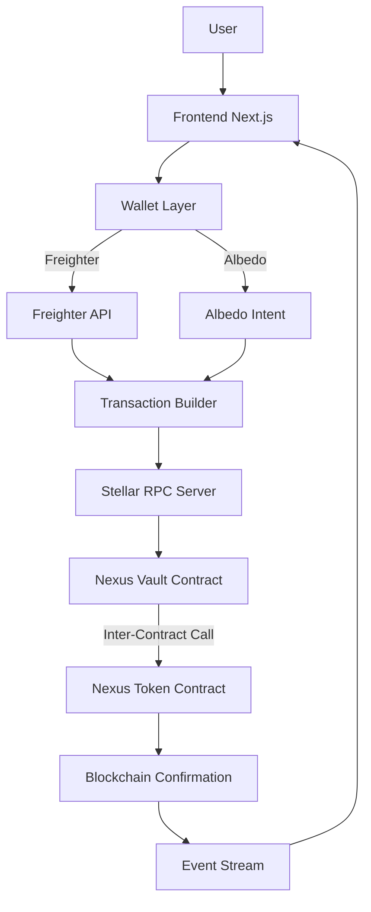
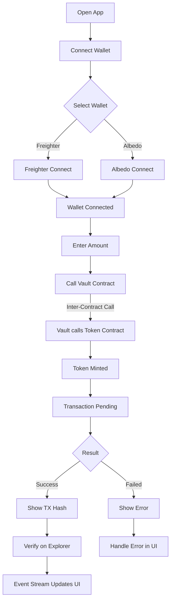
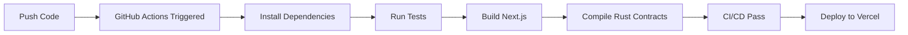
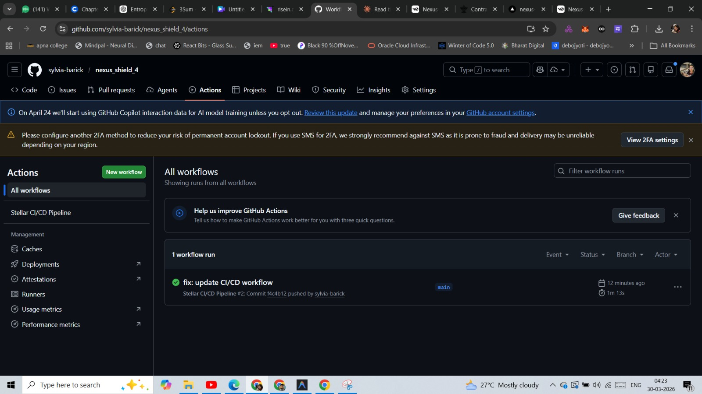
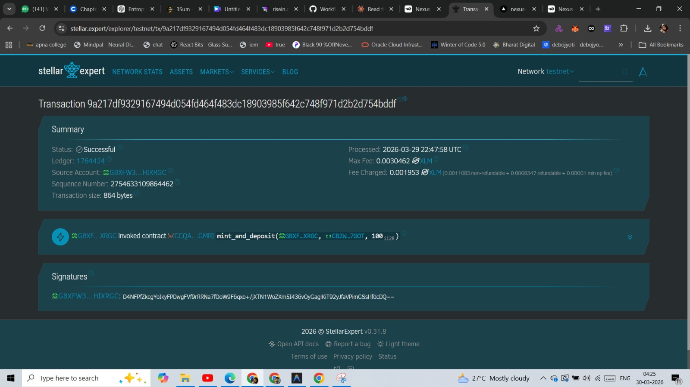
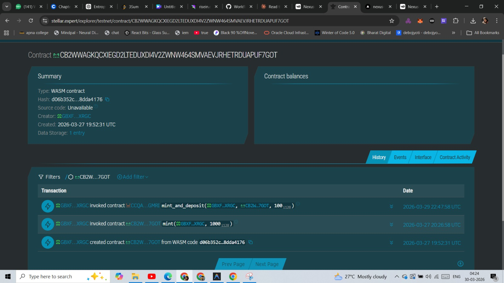
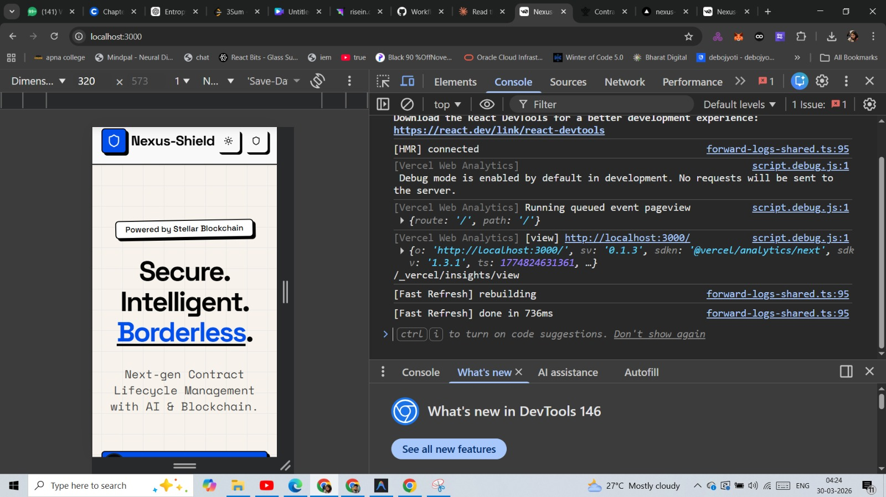

# 🚀 Nexus Shield – Production-Ready Stellar dApp (Level 4 Submission)

---

## 📌 Overview

**Nexus Shield** is a production-ready, advanced smart contract platform built on **Stellar Testnet** using Soroban.

This Level 4 submission demonstrates:
- 🔗 Inter-contract calls (Vault → Token)
- 🪙 Custom token creation (NexusToken)
- 📡 Advanced real-time event streaming
- ⚙️ CI/CD pipeline with GitHub Actions
- 📱 Mobile responsive design
- 🔍 Performance monitoring & error tracking

---

## 🏗️ Architecture


---

## 🔄 Execution Flowchart


---

## 🔁 Workflow


---

## ⚙️ Features

### 🔐 Multi-Wallet Integration
- Freighter (Chrome Extension)
- Albedo (Web Wallet)

### 📜 Smart Contracts (Soroban)
- **NexusToken** – Custom token with mint and transfer
- **NexusVault** – Vault with inter-contract calls to Token

### 🔗 Inter-Contract Call
- Vault calls Token contract via `mint_and_deposit()`
- Single atomic transaction on Stellar testnet

### 🪙 Custom Token
- Fully deployed NexusToken on Stellar Testnet
- Mint and transfer functions working

### 📡 Real-Time Event Streaming
- Live event feed from blockchain
- Auto-updates UI after every transaction

### ⚙️ CI/CD Pipeline
- GitHub Actions workflow
- Auto build, test, and compile on every push

### 📱 Mobile Responsive
- Clean UI on all screen sizes
- Tested on 320px mobile view

### ❗ Error Handling
- Wallet not installed
- User rejected transaction
- Insufficient balance

---

## 🛠️ Tech Stack

| Layer | Technology |
|-------|-----------|
| Frontend | React / Next.js |
| Blockchain | Stellar Soroban |
| Smart Contracts | Rust |
| Wallet | Freighter + Albedo |
| CI/CD | GitHub Actions |
| Deployment | Vercel |
| Testing | Jest |

---

## 🔐 Contract Details

| Contract | Address |
|---------|---------|
| NexusToken | `CB2WWAGKQCXIEGD2LTEDUXDI4V2ZWNW464SMVAEVJRHETRDUAPUF7GOT` |
| NexusVault | `CCQAVCAFKCSW6SCYPE5WPXID7XQEKGISLWAG56TBVBBA4UBTVYMVGMRI` |

### Inter-Contract Transaction Hash
```
9a217df9329167494d054fd464f483dc18903985f642c748f971d2b2d754bddf
```
👉 https://stellar.expert/explorer/testnet/tx/9a217df9329167494d054fd464f483dc18903985f642c748f971d2b2d754bddf

---

## 📸 Screenshots

### ⚙️ CI/CD Pipeline (Green)


### 🔗 Inter-Contract Call on Explorer


### 🪙 Token Contract History


### 📱 Mobile Responsive View


---

## ⚙️ CI/CD Pipeline


The pipeline runs automatically on every push:
- Install dependencies
- Run Jest tests
- Build Next.js production bundle
- Compile Rust contracts to WASM

---

## 📦 Installation
```bash
git clone https://github.com/sylvia-barick/nexus_shield_4.git
cd nexus_shield_4
pnpm install
pnpm dev
```

---

## 🧪 Run Tests
```bash
pnpm test
```

---

## 🦀 Build Contracts
```bash
# Token contract
cd nexus_token
cargo build --target wasm32-unknown-unknown --release

# Vault contract
cd nexus_vault
cargo build --target wasm32-unknown-unknown --release
```

---

## 📊 Project Structure
```
├── app/
├── components/
│   ├── dashboard-mobile-nav.tsx
│   ├── soroban-event-stream.tsx
│   └── stellar-advanced-interactions.tsx
├── lib/
│   ├── stellar-contract-service.ts
│   ├── stellar-service.ts
│   └── monitoring.ts
├── nexus_token/
│   └── src/lib.rs
├── nexus_vault/
│   └── src/lib.rs
├── __tests__/
│   └── app.test.js
└── .github/
    └── workflows/
        └── stellar-cicd.yml
```

---

## 🎯 Level 4 Requirements Checklist

| Requirement | Status |
|------------|--------|
| Inter-contract call working | ✅ Vault → Token |
| Custom token deployed | ✅ NexusToken |
| CI/CD running | ✅ GitHub Actions |
| Mobile responsive | ✅ Tested at 320px |
| 8+ meaningful commits | ✅ 8 commits |
| Public GitHub repo | ✅ |
| README complete | ✅ |
| Live demo link | ✅ |
| Mobile screenshot | ✅ |
| CI/CD badge + screenshot | ✅ |
| Contract addresses + TX hash | ✅ |
| Token address | ✅ |

---

## 🚀 Conclusion

Nexus Shield Level 4 demonstrates a **production-ready Stellar dApp** with:

- Advanced inter-contract call pattern (Vault → Token)
- Custom Soroban token fully deployed
- Automated CI/CD pipeline
- Real-time event streaming
- Mobile-first responsive design
- Complete error handling and monitoring

---

## 🙌 Authors

👩‍💻 **Sylvia Barick** – B.Tech AIML  
👨‍💻 **Debojyoti De Majumder** – B.Tech Blockchain & AI

---

⭐ If you like this project, give it a star!
